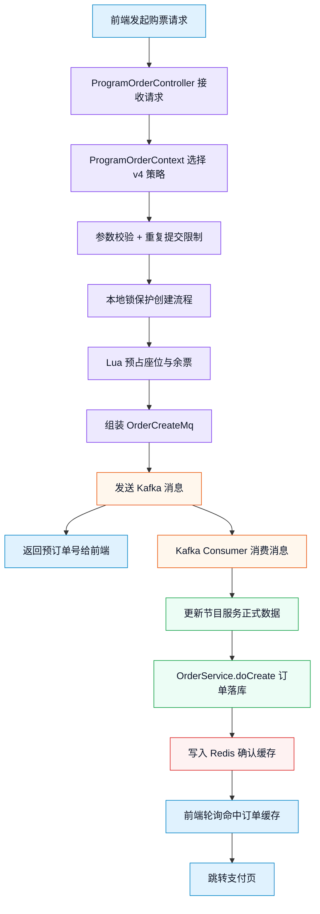
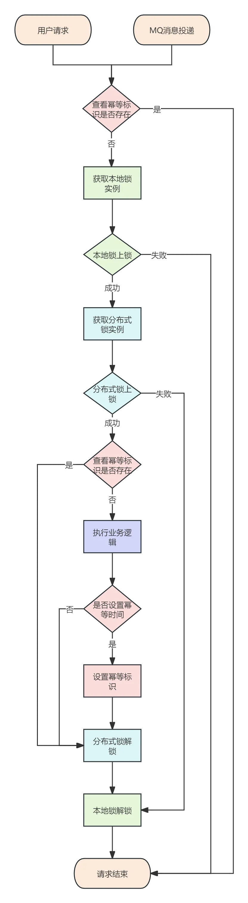
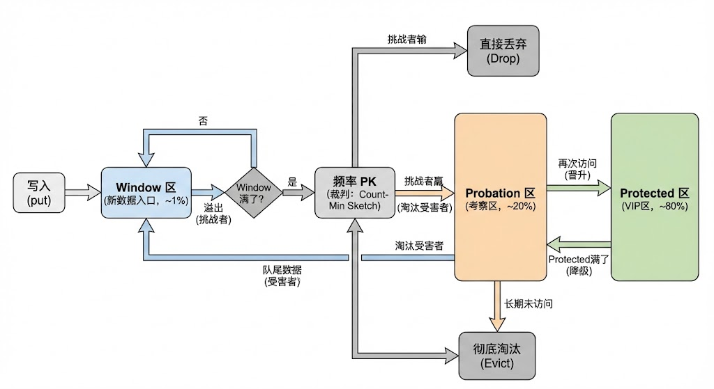
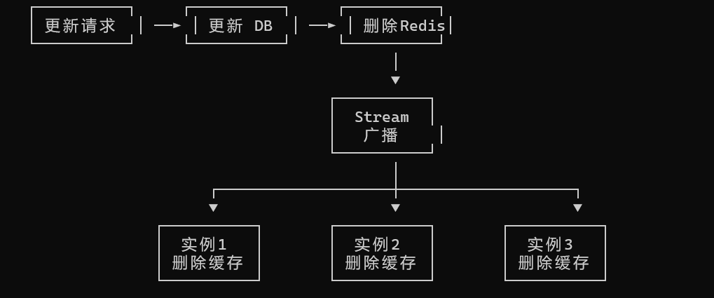
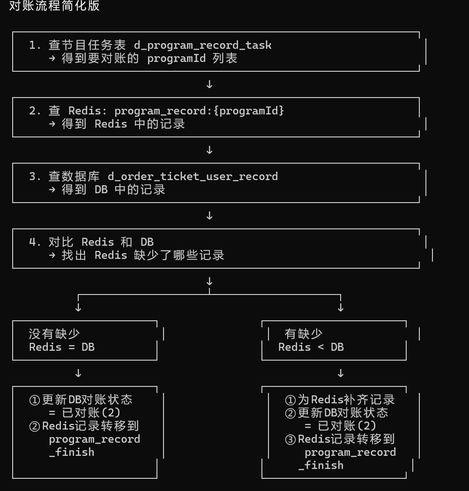

# 大麦抢票系统 - 高并发架构设计笔记

> **文档说明**：本文档记录大麦抢票系统的高并发架构设计要点，采用 `Why → How → 面试追问` 三段式结构，便于面试复习与技术复盘。

---

## 📑 目录

- [一、购票流程](#一购票流程)
- [二、核心问题](#二核心问题)
- [三、解决方案](#三解决方案)
  - [3.1 幂等性设计](#31-幂等性设计)
  - [3.2 Redis + Lua 原子扣减](#32-redis--lua-原子扣减)
  - [3.3 Caffeine 本地缓存](#33-caffeine-本地缓存)
  - [3.4 数据库与缓存一致性](#34-数据库与缓存一致性)
  - [3.5 多级缓存一致性](#35-多级缓存一致性)
  - [3.6 Redisson 延迟队列](#36-redisson-延迟队列)
  - [3.7 Redis 主从切换数据丢失](#37-redis-主从切换数据丢失)
  - [3.8 延迟队列消息可靠性](#38-延迟队列消息可靠性)
- [3.9 Kafka 消息积压问题](#39-kafka-消息积压问题排查与解决方案)
- [四、高效获取节目详情](#四高效获取节目详情)
- [五、分库分表](#五分库分表)
- [六、简历亮点](#六简历亮点)

---

## 一、购票流程

### 1.1 流程图




### 1.2 简化流程


```
下单请求 → 参数校验 → 预占库存和座位 → 发送 Kafka 返回预订单号 → 消费消息更新节目数据 → 订单落库 → 写入确认缓存 → 前端轮询成功进入支付 → 超时未支付恢复库存
```

---

## 二、核心问题

| 序号 | 问题 | 状态 |
|------|------|------|
| 1 | 幂等性如何保证？ | ✅ 已解决 |
| 2 | Redis + Lua 如何设计原子扣减？ | ✅ 已解决 |
| 3 | 如何对 Redis 进行限流保护？（Caffeine 本地缓存） | ✅ 已解决 |
| 4 | 如何保证缓存与数据库的一致性？ | ✅ 已解决 |
| 5 | 如何保证多级缓存的数据一致性？ | ✅ 已解决 |
| 6 | 为什么使用 Redisson 延迟队列而非 MQ？ | ⚠️ 待补充 |
| 7 | 如何解决 Redis 主从切换后的数据丢失？ | ✅ 已解决 |
| 8 | 延迟队列消息丢失或消费失败如何处理？ | ✅ 已解决 |
| 9 | Kafka 消息积压如何排查和解决？ | ✅ 已解决 |

---

## 三、订单相关

---

### 3.1 幂等性设计

#### Why：为什么需要幂等性？

> **幂等性**：多次操作产生的结果与一次操作相同。

**问题场景**：
- 引入分布式锁后，锁只能保证请求有序排队执行
- 但无法过滤重复无效请求，同一用户的多次请求最终都会执行
- 导致系统效率降低，可能产生重复订单

**解决目标**：在下单环节过滤同一用户的重复请求，只保留一次有效请求。

#### How：如何设计？

**核心思路**：`AOP + 注解 + 本地锁 + 分布式锁` 四层防护

| 组件 | 作用 | 说明 |
|------|------|------|
| **AOP + 注解** | 无侵入式拦截 | 方法加注解即可生效，无需改动业务代码 |
| **本地锁** | 过滤单机重复请求 | 减少对 Redis 的请求压力 |
| **分布式锁** | 过滤集群重复请求 | 保证多节点集群下的幂等性 |
| **幂等性 Key** | 唯一标识购票意图 | 格式：`演出ID + 用户ID` |

**流程图**：



#### 面试追问

**Q：为什么要用本地锁 + 分布式锁双重保障？**

| 锁类型 | 作用范围 | 核心目的 |
|--------|----------|----------|
| 本地锁 | 单 JVM 实例内 | 先拦截单机重复请求，减少对 Redis 的压力 |
| 分布式锁 | 整个集群 | 兜底保障，防止多节点间的并发冲突 |

> **总结**：两者配合，既保证正确性又提升性能。

---

### 3.2 Redis + Lua 原子扣减

#### Why：为什么需要 Redis + Lua？

**问题**：高并发下，普通 Redis 操作存在竞态条件

```java
// ❌ 错误示例：非原子操作（两步网络请求之间可能被其他线程插入）
int stock = redis.get("ticket:stock");
if (stock > 0) {
    redis.decr("ticket:stock");  // 可能导致超卖
}
```

**风险**：`get` 和 `decr` 是两次网络请求，中间可能被其他请求插入，导致**超卖**。

**解决**：使用 Lua 脚本，Redis 将整个脚本作为**原子操作**执行，中间不会被打断。

#### How：如何设计？

**核心思路**：将 Java 层分三步执行的逻辑（查库存 → 算座位 → 扣库存），全部下沉到 **Redis Lua 脚本**中。

利用 Redis 单线程执行 Lua 的特性，保证三个操作在**毫秒级**内完成，且**不可被插队**。

**Lua 脚本示例**（伪代码逻辑版）：

```lua
-- ==========================================================
-- 1. 接收参数 (Input)
-- ==========================================================
local program_id = "1001"
local ticket_category_id = "5001"
local buy_count = 2

-- 定义 Redis Key
-- 库存 Key: "program_ticket_remain_number:1001"
-- 未售 Key: "program_seat_no_sold:1001:5001"
-- 锁定 Key: "program_seat_lock:1001:5001"

-- ==========================================================
-- 2. 查库存 (Verify Stock)
-- ==========================================================
local stock_str = redis.call('hget', 'program_ticket_remain_number:1001', '5001')

if not stock_str then
    return 40010  -- 报错：票档不存在
end

if tonumber(stock_str) < buy_count then
    return 40011  -- 报错：库存不足
end

-- ==========================================================
-- 3. 拉取所有未售座位 (Fetch & Decode)
-- ==========================================================
local all_seat_json_strings = redis.call('hvals', 'program_seat_no_sold:1001:5001')

-- 字符串转对象
local seat_objects = {}
for i, json in ipairs(all_seat_json_strings) do
    table.insert(seat_objects, cjson.decode(json))
end

-- ==========================================================
-- 4. 内存算法找连座 (Algorithm)
-- ==========================================================
sort_seats(seat_objects)

local target_seats = find_adjacent(seat_objects, buy_count)

if #target_seats < buy_count then
    return 40004  -- 报错：没有连座了
end

-- ==========================================================
-- 5. 准备数据 & 修改状态 (Prepare)
-- ==========================================================
local del_ids = {}    -- 要删除的 ID 列表
local lock_data = {}  -- 要存入锁定表的 Key-Value 列表

for i, seat in ipairs(target_seats) do
    table.insert(del_ids, seat.id)
    
    -- 关键：内存修改状态 1(未售) -> 2(锁定)
    seat.sellStatus = 2
    
    table.insert(lock_data, seat.id)
    table.insert(lock_data, cjson.encode(seat))
end

-- ==========================================================
-- 6. 原子落库 (Atomic Commit - 三连击)
-- ==========================================================

-- 第一击：扣减库存
redis.call('hincrby', 'program_ticket_remain_number:1001', '5001', -buy_count)

-- 第二击：从未售池删除
redis.call('hdel', 'program_seat_no_sold:1001:5001', unpack(del_ids))

-- 第三击：添加到锁定池
redis.call('hmset', 'program_seat_lock:1001:5001', unpack(lock_data))

-- 返回购买的座位
return target_seats
```

#### 设计优点

| 优点 | 说明 |
|------|------|
| **原子性** | 整个脚本在 Redis 单线程执行，不会被打断 |
| **避免超卖** | 检查和扣减在同一操作中完成 |
| **减少网络开销** | 一次网络请求完成多个操作 |
| **可扩展** | 可在脚本中加入更多校验逻辑 |

#### 面试追问

**Q：Lua 脚本会阻塞 Redis 吗？**

> **会**。Redis 执行 Lua 是单线程阻塞的，因此：
> - 脚本要尽量简短，避免复杂循环
> - 生产环境建议用 `SCRIPT LOAD` 预加载脚本，用 `EVALSHA` 调用，减少网络传输

---

### 3.3 Caffeine 本地缓存

#### Why：为什么要引入 Caffeine？

**问题场景**：
- 高并发下仅靠 Redis，大量请求可能打垮 Redis
- 需要在 Redis 前引入一层本地缓存，替 Redis 承担流量

**方案对比**：

| 方案 | 特点 | 问题 |
|------|------|------|
| ConcurrentHashMap | 简单 Map 结构 | 无自动清理，长期占用内存 |
| **Caffeine** | 支持 TTL + 最大容量限制 | ✅ 到时间或达容量自动清除 |

#### How：底层原理

**流程图**：



**Caffeine 总体分为两个区域**：

| 区域 | 子区域 | 说明 |
|------|--------|------|
| **Window 区** | - | 存放新插入的数据，应对突发流量 |
| **Main 区** | **Protected（VIP 区 - 80%）** | 真正的热点数据，受保护不轻易淘汰 |
| | **Probation（观察区）** | 存放刚从 Window 区下来的数据或久未访问的数据 |

#### 面试追问

**Q：Caffeine 使用的淘汰算法是什么？相比传统 LRU/LFU 有什么优势？**

| 算法 | 特点 | 缺陷 |
|------|------|------|
| **传统 LRU** | 保留最新数据 | 只按最近未访问淘汰，可能淘汰长期高频热点数据 |
| **传统 LFU** | 保留频率最高数据 | 新数据存入困难，历史热点数据一直存在，污染缓存 |
| **W-TinyLFU** | 引入分区思想和频率统计 | ✅ 新数据进窗口区，高频数据进保护区，低频优先淘汰 |

> **W-TinyLFU 优势**：定期清理数据，保证数据鲜活度，兼顾新旧数据。

---

### 3.4 数据库与缓存一致性

#### Why：为什么需要保证一致性？

> 使用 Redis + Lua 原子扣减库存和座位状态，支付成功后通过延迟队列异步落库，将数据库写入延迟分散以削峰；本地消息表记录所有待落库操作，保证最终一致性。

#### How：解决方案

**核心策略**：

```
Redis 扣减 → 延迟队列异步落库 → 本地消息表记录 → 最终一致性
```

| 环节 | 作用 |
|------|------|
| Redis 原子扣减 | 保证高并发下的库存准确性 |
| 延迟队列 | 异步削峰，分散数据库写入压力 |
| 本地消息表 | 记录所有待落库操作，便于对账和补偿 |

---

### 3.5 多级缓存一致性

#### Why：为什么需要多级缓存？

> 单级缓存（仅 Redis）在高并发下仍可能成为瓶颈，需要引入本地缓存分担压力。

#### How：解决方案

**核心思路**：使用中间件（MQ）或 Redis Stream 实现消息通知机制

**流程**：
1. 数据库数据被更改
2. 删除对应 Redis 缓存
3. 通过 Stream 通知所有实例删除本地缓存

**简化版流程**：



**关键代码**：

```java
// 1. 更新数据时 - 发送通知
public Boolean invalid(ProgramInvalidDto dto) {
    programMapper.updateById(program);           // ① 更新数据库
    delRedisData(dto.getId());                   // ② 删除 Redis 缓存
    redisStreamPushHandler.push(dto.getId());    // ③ 发送 Stream 通知
    return true;
}

// 2. 消费消息时 - 删除本地缓存
@Override
public void accept(ObjectRecord<String, String> message) {
    Long programId = Long.parseLong(message.getValue());
    programService.delLocalCache(programId);     // 删除本地缓存
}
```

#### 面试追问

**Q：为什么用 Redis Stream 而不是 Redis Pub/Sub？**

| 对比项 | Redis Pub/Sub | Redis Stream |
|--------|---------------|--------------|
| 消息持久化 | ❌ 不持久化 | ✅ 持久化 |
| 离线消息 | ❌ 丢失 | ✅ 可消费 |
| 消费确认 | ❌ 无 | ✅ ACK 机制 |

> **结论**：Stream 提供持久化和 ACK 机制，更适合缓存失效广播场景。

---

### 3.6 Redisson 延迟队列

> ⚠️ **待补充**：本节内容需要进一步完善

#### Why：为什么使用 Redisson 延迟队列？

#### How：与 MQ 的对比优势

| 对比项 | Redisson 延迟队列 | MQ 延迟队列 |
|--------|-------------------|-------------|
| 中间件依赖 | Redis 自带，无需额外引入 | 需引入 Kafka/RabbitMQ 等 |
| 持久化 | ✅ 支持 | ✅ 支持 |
| 运维成本 | 低（复用现有 Redis） | 高（需维护 MQ 集群） |

---

### 3.7 Redis 主从切换数据丢失

#### Why：为什么需要解决这个问题？

**风险**：Redis 中存储了余票数量、座位状态、票档信息等关键数据，若丢失会导致**超卖**。

**具体场景**：

```
用户A购买：余票 100 → 99，座位 id201 被锁定
    ↓
主节点挂了，从节点提升为新主节点
    ↓
主从复制异步延迟（10-100ms），从节点数据未同步
    ↓
从节点余票仍为 100，座位 id201 未锁定
    ↓
用户B购买座位 201：检查通过 → 超卖！
```

**后果**：
- 用户A和用户B都买了座位 201 → **超卖**
- 数据库已有用户A订单，但 Redis 数据丢失 → **数据不一致**

#### How：如何解决？

**核心思路**：增加 Redis 对账记录 + 数据库对账表，启动定时任务扫描比对，发现缺失则补偿。

**Redis 对账记录结构**：

| 项目 | 说明 |
|------|------|
| Key | `my-d_mai_program_record_{programId}` |
| 结构 | Hash |
| Field | `{RecordType_recordId_userId}` |
| Value | JSON 格式的操作记录 |

**Value 示例**：

```json
{
  "recordType": "reduce",
  "timestamp": 1772182870048,
  "ticketCategoryRecordList": [
    {
      "ticketCategoryId": 28,
      "beforeAmount": 50,
      "afterAmount": 49,
      "changeAmount": 1,
      "seatRecordList": [
        {
          "seatId": 651,
          "ticketCategoryId": 28,
          "ticketUserId": 1834367990817800000,
          "beforeStatus": 1,
          "afterStatus": 2
        }
      ]
    }
  ]
}
```

**对账流程**：



---

### 3.8 延迟队列消息可靠性

#### Why：为什么需要解决这个问题？

**风险**：消息在发送或消费过程中可能因为网络抖动、服务宕机等原因丢失，导致订单状态不一致。

**典型问题**：用户超时未支付，但座位一直被锁定，无法释放给其他用户。

#### How：解决方案

**核心思路**：设计**发送记录表**和**消费记录表**记录消息状态，配合后台人工对账补偿。

**公共字段**（两张表都有）：

| 字段 | 说明 |
|------|------|
| `message_type` | 消息类型（详见 MessageType 枚举） |
| `message_trace_id` | 消息链路 ID |
| `message_businesses_id` | 消息业务 ID |
| `message_id` | 消息 ID |
| `message_topic` | 消息的 Topic |
| `message_content` | 消息内容 |
| `reconciliation_status` | 对账状态：1-未对账，-1-对账有问题，2-对账无问题，3-问题已处理 |

**发送记录表特有字段**：

| 字段 | 说明 |
|------|------|
| `message_send_status` | 发送状态：1-未发送，-1-发送失败，2-发送成功 |
| `message_send_exception` | 发送失败的异常信息 |
| `send_time` | 消息发送时间 |

**消费记录表特有字段**：

| 字段 | 说明 |
|------|------|
| `message_consumer_status` | 消费状态：1-未消费，-1-消费失败，2-消费成功 |
| `message_consumer_exception` | 消费失败的异常信息 |
| `message_consumer_count` | 消费次数（用于重试判断） |
| `consumer_time` | 消息消费时间 |

#### 发送端流程

```
① 插入消息记录表（状态：未发送）
    ↓
② 发送消息到延迟队列
    ↓
③ 根据结果更新状态（成功/失败 + 异常信息）
```

```java
// 1. 插入消息记录
MessageProducerRecordVo record = apiDataClient.insertMessageProducerRecord(dto).getData();

// 2-3. 发送消息并更新状态
try {
    delayQueueContext.sendMessage(topic, content, delayTime, timeUnit);
    updateStatus(record.getId(), SEND_SUCCESS);
} catch (Exception e) {
    updateStatus(record.getId(), SEND_FAIL, e.getMessage());
}
```

#### 消费端流程

```
① 幂等检查：若已消费成功则直接返回
    ↓
② 插入或更新消费记录（记录消费次数）
    ↓
③ 执行业务逻辑（取消订单、恢复库存等）
    ↓
④ 根据结果更新消费状态
```

```java
// 1. 幂等性检查
MessageConsumerRecordVo record = getByMessageId(messageId);
if (record != null && record.getStatus() == CONSUMER_SUCCESS) return;

// 2. 插入或更新消费次数
Long recordId = (record == null) ? insertRecord(messageId) : record.getId();
int count = (record == null) ? 1 : record.getCount() + 1;

// 3-4. 执行业务并更新状态
try {
    orderService.cancel(orderNumber);
    updateStatus(recordId, count, CONSUMER_SUCCESS);
} catch (Exception e) {
    updateStatus(recordId, count, CONSUMER_FAIL, e.getMessage());
}
```

---

### 3.9 Kafka 消息积压问题排查与解决方案

#### Why：为什么会积压？

**根本原因**：消费端处理速度慢于生产端生产速度。

**消费端原因**：

| 原因 | 说明 |
|------|------|
| **业务逻辑太重** | 消费一条消息要调多个外部服务，其中一个服务响应慢，拖垮整个消费链路 |
| **依赖服务故障** | Redis 或数据库挂了，导致消费端阻塞 |
| **消费线程不足** | Kafka 消费者默认单线程拉取消息，若业务处理也是单线程，处理能力有限 |
| **代码问题** | 消费端代码存在性能瓶颈或死锁等问题 |

**生产端原因**：

| 原因 | 说明 |
|------|------|
| **流量暴增** | 生产端流量突增，超出消费端处理能力 |

#### How：如何解决

**解决思路**：先定位 → 再应急 → 最后根治

**① 定位问题**

| 检查项 | 方法 |
|--------|------|
| **Consumer Lag** | 查看消费延迟，确认是生产快了还是消费慢了 |
| **消费者健康状态** | 检查消费者实例是否存活、是否有 rebalance |
| **下游依赖** | 排查 Redis、数据库等依赖是否拖累消费者 |

**② 紧急消峰（快速消化积压）**

| 方案 | 适用场景 | 注意事项 |
|------|----------|----------|
| **增加消费者数量** | 消费者数量 < 分区数量时 | 消费者数量 ≤ 分区数量，超过不生效 |
| **增加分区数量** | 长期容量不足 | 需要重启消费者，会有短暂中断 |
| **丢弃临时消息** | 日志消息、过时通知等非核心消息 | 仅对可丢弃的消息类型使用 |

**③ 根治方案（长期优化）**

| 方案 | 说明 |
|------|------|
| **异步处理** | 消费者对非核心消息（如日志）进行异步处理，不阻塞主流程 |
| **生产端限流** | 生产者做好限流保护，避免流量突增压垮消费端 |


---

## 四、高效获取节目详情

### 4.1 核心问题

| 序号 | 问题 | 状态 |
|------|------|------|
| 1 | 如何解决缓存击穿、缓存雪崩、缓存穿透？ | ✅ 已解决 |
| 2 | 节目详情如何设计缓存？ | ✅ 已解决 |

### 4.2 缓存三问题解决方案

#### Why：什么是缓存三问题？

| 问题 | 定义 | 影响 |
|------|------|------|
| **缓存击穿** | 某个热点 Key 过期，大量请求直接访问数据库 | 数据库压力骤增 |
| **缓存雪崩** | 大量数据同时过期或 Redis 宕机 | 请求全部打到数据库 |
| **缓存穿透** | 查询不存在的数据（缓存和数据库都没有） | 请求穿透到数据库 |

#### How：解决方案

**① 缓存击穿：分布式锁 + 双重检测**

```java
@ServiceLock(lockType = LockType.Read, name = PROGRAM_LOCK, keys = {"#programId"})
private ProgramVo getById(Long programId) {
    // 第一重检测：先从缓存查询
    ProgramVo programVo = redisCache.get(
        RedisKeyBuild.createRedisKey(RedisKeyManage.PROGRAM, programId),
        ProgramVo.class
    );
    
    if (Objects.nonNull(programVo)) {
        return programVo;  // 缓存命中，直接返回
    }
    
    // 获取分布式锁
    RLock lock = serviceLockTool.getLock(
        LockType.Reentrant,
        GET_PROGRAM_LOCK,
        new String[]{String.valueOf(programId)}
    );
    lock.lock();
    
    try {
        // 第二重检测：获得锁后再次查询缓存
        return redisCache.get(
            RedisKeyBuild.createRedisKey(RedisKeyManage.PROGRAM, programId),
            ProgramVo.class,
            () -> createProgramVo(programId),  // 缓存未命中，查询数据库
            EXPIRE_TIME,
            TimeUnit.DAYS
        );
    } finally {
        lock.unlock();
    }
}
```

> **关键点**：
> - `LockType.Read`：开启读锁，若读时有线程持有写锁正在改数据则互斥，保证数据一致性
> - **双重检测**：防止后续未获得锁的请求，在获得锁后重复查询数据库

**② 缓存雪崩：差异化过期时间**

```java
// 缓存过期时间设置到所属节目的演出时间
redisCache.set(
    RedisKeyBuild.createRedisKey(RedisKeyManage.PROGRAM_SHOW_TIME, programId),
    programShowTime,
    DateUtils.countBetweenSecond(DateUtils.now(), programShowTime.getShowTime()),
    TimeUnit.SECONDS
);
```

> **策略**：根据节目时间与当前时间的差值作为过期时间，避免大量 Key 同时过期。

**③ 缓存穿透：布隆过滤器**

```java
public void doExist(String mobile) {
    // 快速判断元素是否存在
    boolean contains = bloomFilterHandler.contains(mobile);
    
    // 可能存在则查询数据库确认
    if (contains) {
        LambdaQueryWrapper<UserMobile> queryWrapper = Wrappers.lambdaQuery(UserMobile.class)
            .eq(UserMobile::getMobile, mobile);
        UserMobile userMobile = userMobileMapper.selectOne(queryWrapper);
        
        if (Objects.nonNull(userMobile)) {
            throw new DaMaiFrameException(BaseCode.USER_EXIST);
        }
    }
}
```

> **策略**：布隆过滤器快速判断不存在元素，若可能存在再查询数据库确认。

### 4.3 节目详情三级缓存设计

#### Why：为什么要用三级缓存？

> 节目详情页是抢票场景下访问频率最高的页面之一，单靠 Redis 可能扛不住流量，需要引入本地缓存分担压力。

#### How：三级缓存架构

**架构层次**：`本地缓存 → Redis → 数据库`

**查询流程**：

```
① 查本地缓存 → 命中则直接返回
    ↓ 未命中
② 查 Redis → 命中则返回并回写本地缓存
    ↓ 未命中
③ 查数据库 → 返回并回写 Redis 和本地缓存
```

**流程图**：

.png)

#### 数据类型适配分析

| 数据类型 | 是否适合本地缓存 | 原因 |
|----------|------------------|------|
| 节目详情 | ✅ 适合 | 变化少，所有用户共享同一份数据 |
| 节目展示 | ✅ 适合 | 变化少，全局共享 |
| 座位信息 | ❌ 不适合 | 下单时频繁变化（售卖→锁定），需实时同步 |
| 用户购票人 | ❌ 不适合 | 用户私有数据，多实例缓存不一致 |

> **原则**：不适合本地缓存的数据放 Redis（座位状态、用户购票人等频繁变化或用户维度的数据）。

---

## 五、分库分表

### 5.1 核心问题

| 序号 | 问题 | 状态 |
|------|------|------|
| 1 | 项目中的分布式事务如何解决？ | ✅ 已解决 |

### 5.2 分布式事务解决方案

#### Why：为什么不用 Seata 等分布式框架？

**Seata 架构**：需要借助 TM、TC、RM 三个角色

| 角色 | 持有/管理 | 职责 |
|------|-----------|------|
| **TM** (Transaction Manager) | 全局事务生命周期 | 开启全局事务 → 调用业务 → 发起提交/回滚 |
| **TC** (Transaction Coordinator) | 全局锁 | 维护全局事务状态，管理全局锁的分配与释放 |
| **RM** (Resource Manager) | 本地事务 + 分支事务 | 执行本地 SQL，注册分支到 TC，申请/释放全局锁 |

**分支事务执行流程**：

```
解析 SQL → 开启本地事务 → 获取全局锁 → 记录 undo 表 → 提交本地事务 → 上报 TC 状态
```

**问题**：全局锁在整个过程中一直持有，直到第二阶段 TM 派 TC 协调 RM 异步清理 undo 表才释放。

**结论**：

```
服务越多 → 全局事务越长 → 锁持有越久 → 热点行竞争越激烈 → 高并发下吞吐量暴跌
```

#### How：项目如何解决？

**核心思路**：不使用 Seata，依靠 ShardingSphere 对同服务库表的事务管理，跨服务调用采用**最终一致性**方案。

**场景分析**：

| 操作 | 结果 | 影响 | 可接受性 |
|------|------|------|----------|
| 扣库存成功 → 调用订单服务失败 | 库存已扣，订单未生成 | 少卖 | ✅ 可接受 |

**解决方案**：

1. 扣库存成功但订单失败 → 记录失败日志，后台人工处理
2. **核心原则**：宁可少卖，不可超卖

---

## 六、简历亮点

---

### 6.1 分布式锁组件设计

**简历描述**：

> 基于**工厂**+**策略**模式实现多类型锁支持（可重入/读写锁），提供**注解声明**与**编程调用**两种方式。采用"本地锁+分布式锁+幂等标识"三层防护，结合 Redisson 锁与 Redis 记录双重保障，通过切面顺序控制解决锁与事务的时序问题，确保高并发场景下的幂等性。

**可能追问**：

1. 如果加锁在事务开启之后，会导致什么问题？
2. 工厂模式和策略模式分别解决了什么问题？两者怎么配合的？
3. 自定义注解 + AOP 和方法调用两种加锁方式，分别适用于什么场景？

**回答**：

**① 如果加锁在事务开启之后？**

> 事务切面会包裹锁切面，每个请求先开启事务再获取锁，释放锁后但事务还未提交，后续读取的请求会读到未提交的旧值，根据旧值更新数据库导致**更新丢失**。

**② 工厂模式和策略模式如何配合？**

| 模式 | 解决问题 | 职责 |
|------|----------|------|
| **工厂模式** | 锁的创建问题 | 开发者只需知道工厂和锁类型，无需关注实际创建方式 |
| **策略模式** | 锁的行为统一 | 统一锁的行为接口，支持多种锁实现灵活切换，新增锁类型只需实现接口 |

**③ 两种加锁方式的适用场景？**

| 方式 | 适用场景 | 特点 |
|------|----------|------|
| **注解 + AOP** | 事务协调场景 | 通过 `@Order` 控制切面顺序实现锁包裹事务 |
| **方法调用** | 灵活加锁场景 | 可在任何地方加锁，不依赖切面 |

---

### 6.2 分布式 ID 生成器设计

**简历描述**：

> 利用雪花算法 + Lua + Redis 设计分布式 ID 生成器，通过 Redis 原子操作实现 workerId 的自动分配与回收，解决 MybatisPlus 在 Docker 集群下的生产缺陷，消除手动配置机器 ID 的运维成本。

**可能追问**：

1. 什么是时钟回拨？为什么会导致问题？
2. 如何解决时钟回拨？

**回答**：

**① 什么是时钟回拨？**

| 概念 | 说明 |
|------|------|
| **时钟回拨** | 把服务器时间调整到过去的时间 |
| **问题** | 雪花算法基于时间戳确定唯一 ID，如果发生时钟回拨，生成的 ID 可能重复 |

**② 如何解决时钟回拨？**

| 策略 | 说明 |
|------|------|
| **延迟等待** | 进行延迟等待对应回拨时间直到正常时间 |
| **异常兜底** | 如果回拨时间过长则直接抛出异常 |

```java
// 相同毫秒内，序列号自增
sequence = (sequence + 1) & sequenceMask;
if (sequence == 0) {
    // 同一毫秒的序列数已经达到最大，等待下一毫秒
    timestamp = tilNextMillis(lastTimestamp);
}
```

---

### 6.3 初始化框架设计

**简历描述**：

> 设计可插拔初始化框架，**模板方法**封装标准流程，**策略模式**支持自定义扩展，Spring 启动时自动完成缓存预热、配置加载等初始化任务，提升系统可维护性。
>
> 。

**可能追问**：

1. 这两个设计模式在初始化框架中分别承担什么职责？

**回答**：

| 模式 | 职责 |
|------|------|
| **策略模式** | 支持多种初始化阶段灵活切换，便于拓展初始化阶段，只需实现策略接口 |
| **模板方法** | 基本流程固定：到达对应阶段 → 收集策略实现类 → 排序 → 执行初始任务。模板方法固定了这个流程，只需根据时期阶段名字确认要对应时期 |

---

### 6.4 基因法分库分表

**简历描述**：

> 利用**二进制基因法**将用户 ID 基因融入订单编号，通过**基因位分离**使分库和分表使用完全不重叠的 bit 位，实现**订单编号和用户 ID 双维度查询**且不发生读扩散。

**可能追问**：

1. 同一毫秒内可能超过 64 个订单，你的设计如何处理？
2. 扩容时如何保证旧数据平滑迁移？

**回答**：

**① 同一毫秒订单数超限？**

| 策略 | 说明 |
|------|------|
| **雪花算法标准处理** | 序列号用完后，阻塞等待系统时钟推进到下一毫秒 |
| **幂等性控制** | 对单一用户进行幂等性，控制刷单频率 |

```java
// 相同毫秒内，序列号自增
sequence = (sequence + 1) & sequenceMask;
if (sequence == 0) {
    // 同一毫秒的序列数已经达到最大，等待下一毫秒
    timestamp = tilNextMillis(lastTimestamp);
}
```

**② 扩容时数据迁移？**

```
① 全量扫描旧库表
    ↓
② 用订单号重新计算路由
    ↓
③ 需要迁移的写入新库，不需要的跳过
```

---

### 6.5 基于 Redis Stream 的消息队列

**简历描述**：

> 基于 Redis Stream 封装轻量级消息组件，节目数据变更时广播各实例清除本地缓存，复用已有 Redis，相比 Kafka 运维成本更低。

**可能追问**：

1. 多个实例如何各自收到同一条消息？
2. 如果 Redis 宕机了，缓存失效广播会怎样？

**回答**：

**① 多实例广播实现？**

> 广播模式的实现方式：**每个实例直接绑定 Stream，不使用消费组**。
>
> 消费者通过 `receive()` 方法监听 Stream，而不是 `receiveAutoAck()` 绑定消费组。这样每个实例独立读取消息，互不干扰，都能收到全量消息。
>
> **代价**：没有消费进度管理，实例重启会从头消费历史消息。但在这个场景下没问题——消息处理是删除本地缓存，操作是**幂等的**，重复消费没有副作用。

**② Redis 宕机的应对措施？**

| 措施 | 说明 |
|------|------|
| **本地缓存 TTL** | 即使广播失败，缓存也会在过期后自动失效，保证最终一致性 |
| **日志记录** | 消费者侧有日志记录，方便排查问题 |

> **权衡**：节目数据短暂不一致是可以接受的，不需要引入更复杂的可靠性机制。

---

> **文档结束** | 最后更新：2026-06-06
