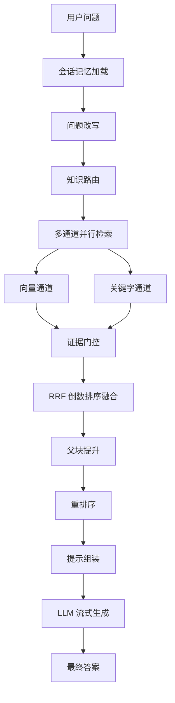

# 超级智能体笔记

> **文档说明**：本文档记录超级智能体中文档生命周期、Kafka 选型、RAG 检索链路等核心流程与设计要点，便于后续复盘与整理。

---

## 📑 目录

- [一、文档生命周期相关](#一文档生命周期相关)
  - [1.1 文档生命周期流程](#11-文档生命周期流程)
  - [1.2 为什么选择 Kafka？](#12-为什么选择-kafka)
  - [1.3 使用 Kafka 时，如何保证文档不会重复消费，或库中出现两份数据？](#13-使用-kafka-时如何保证文档不会重复消费或库中出现两份数据)
  - [1.4 消息顺序性是否有保证？](#14-消息顺序性是否有保证)
- [二、RAG 相关](#二rag-相关)
  - [2.1 RAG 流程](#21-rag-流程)
  - [2.2 为什么要做"双通道"？](#22-为什么要做双通道)
  - [2.3 RRF 为什么不用加权平均？](#23-rrf-为什么不用加权平均)
  - [2.4 为什么要分父子块两层？](#24-为什么要分父子块两层)
  - [2.5 如何做的父块提升？（如果命中多个父块怎么处理）](#25-如何做的父块提升如果命中多个父块怎么处理)

---

## 一、文档生命周期相关

### 1.1 文档生命周期流程


**简化流程**：

```text
上传并持久化 → 解析与策略推荐 → 用户确认策略 → 触发索引构建 → 索引构建执行
```

---

### 1.2 为什么选择 Kafka？

| 维度 | 使用 kafka（异步） | 不使用 kafka（同步） |
|------|--------------------|----------------------|
| 响应速度 | 文档在后台异步解析，用户对主流程几乎无感知 | 用户需要等待整条链路执行完成，体验较差 |
| 持久化 | kafka consumer 宕机后，消息仍会保存在磁盘中，重启后可以继续消费 | 如果仅靠线程池等方式优化，程序宕机后进度容易丢失 |
| 流量削峰 | 流量上涨时，可以通过增加消费者数量或分区数量来应对 | 高峰流量更容易直接压垮服务 |

---

### 1.3 使用 Kafka 时，如何保证文档不会重复消费，或库中出现两份数据？

1. 在文档解析流程中，文档内容转成树形结构节点并入库时，采用"覆盖写"模式：先删除原有节点，再写入当前节点数据，保证库中只保留用户当前文档对应的一份结构化节点数据。
2. `TODO`

---

### 1.4 消息顺序性是否有保证？

1. 跨阶段顺序：整体架构采用"两阶段消费 + 用户确认作为阻断点"的方式，因此两个阶段之间天然具备顺序性。
2. 单线程消费：消费者采用单线程消费模式，不使用多线程并发消费，避免同一文档消息出现乱序执行。

---

## 二、RAG 相关

### 2.1 RAG 流程



**简化流程**：

```text
用户问题 → 会话记忆加载 → 问题改写 → 知识路由 → 多通道并行检索（向量 + 关键字）
        → 证据门控 → RRF 融合 → 父块提升 → 重排序 → 提示组装 → LLM 流式生成 → 最终答案
```

**关键阶段说明**：

| 阶段 | 作用 |
|------|------|
| 会话记忆加载 | 加载历史对话摘要，识别追问场景 |
| 问题改写 | 回指消解、上下文补全、口语转书面语，可拆分多子问题 |
| 知识路由 | 三级评分（范围 → 主题 → 文档）定位最匹配文档 |
| 多通道并行检索 | 向量通道与关键字通道并行执行，互补召回 |
| 证据门控 | 过滤低质量结果，向量按绝对阈值，关键字按相对阈值 |
| RRF 融合 | 按排名而非分数融合多通道结果，缓解尺度不一致问题 |
| 父块提升 | 子块结果按父块聚合，提供更完整的章节上下文 |
| 重排序 | 使用 Cross-Encoder 模型对 Top K 候选做精排 |
| 提示组装 | 控制证据预算，避免上下文溢出与注意力稀释 |

---

### 2.2 为什么要做"双通道"？

| 通道 | 优点 | 缺点 |
|------|------|------|
| 向量通道 | 用户问题更容易命中语义相关的文本向量 | 对于一些专有名词，在向量化过程中容易被模糊 |
| 关键词通道 | 通过关键词命中文本，可精确定位文本与用户问题 | 对于语义相近的话语，但缺少相同的词就无法命中 |
| 双通道 | 结合上述两者优点达到召回率最大化 | — |

---

### 2.3 RRF 为什么不用加权平均？

1. BM2.5 和向量的评分分数范围不一致，无法通过加权来统一分数比重。
2. RRF 通过排名来制定分数，更加简单，而且对于双通道命中文本分数会更加高。

---

### 2.4 为什么要分父子块两层？

这是对于检索精度和文本内容完整性的平衡：

- **子块**：语义、关键词聚焦，面向段落、句子，更加精细，用子块（小块）的向量去找最相关片段 → 高召回精度。
- **父块**：面向章节、小标题，文本更加完整 → 给 LLM 完整上下文。

---

### 2.5 如何做的父块提升？（如果命中多个父块怎么处理）

- 按 `parent_block_id` 分组 `Map<父ID, List<子块>>`
- 查找父块内容 + 合并命中的子块摘要
- 找出父块下最优的子块分数作为 `bestChildScore`
- 父块分数 = `bestChildScore × (1 + supportWeight + multiChannelWeight)`
- 其中 `supportWeight = min(0.36, (childCount - 1) × 0.12)`

> 这意味着：一个父块下命中的子块越多、命中通道越多样，父块的整体相关性分数越高。这模拟了"一个章节中多处提及某个概念 → 该章节与问题高度相关"的直觉。
