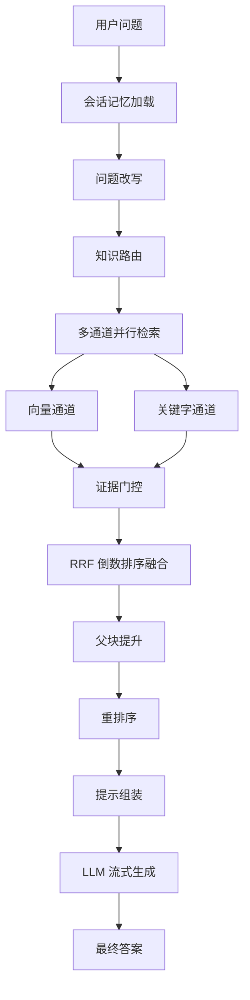
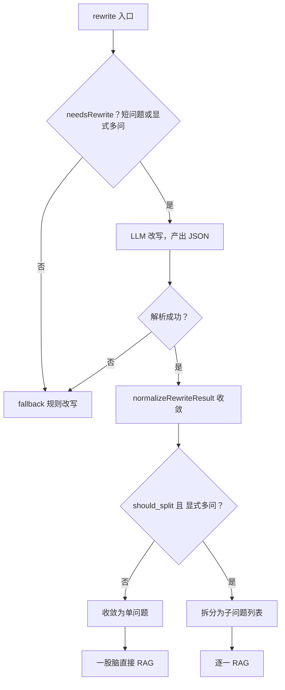
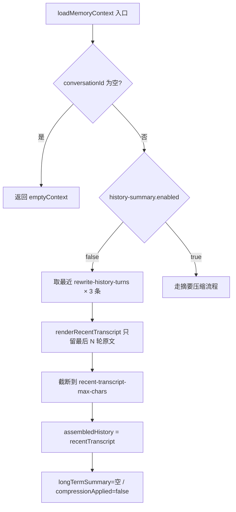
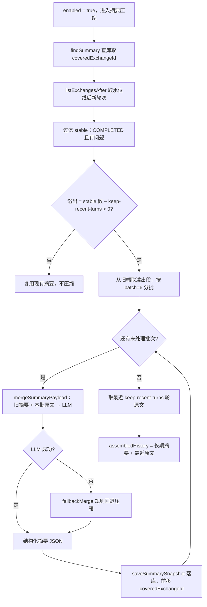

# 超级智能体笔记

> **文档说明**：本文档记录超级智能体中文档生命周期、Kafka 选型、RAG 检索链路等核心流程与设计要点，便于后续复盘与整理。

---

## 📑 目录

- [一、文档生命周期相关](#一文档生命周期相关)
  - [1.1 文档生命周期流程](#11-文档生命周期流程)
  - [1.2 为什么选择 Kafka？](#12-为什么选择-kafka)
  - [1.3 使用 Kafka 时，如何保证文档不会重复消费，或库中出现两份数据？](#13-使用-kafka-时如何保证文档不会重复消费或库中出现两份数据)
  - [1.4 消息顺序性是否有保证？](#14-消息顺序性是否有保证)
  
- [二、RAG 相关](#二rag-相关)
  - [2.1 RAG 流程](#21-rag-流程)
  - [2.2 为什么要做"双通道"？](#22-为什么要做双通道)
  - [2.3 RRF 为什么不用加权平均？](#23-rrf-为什么不用加权平均)
  - [2.4 为什么要分父子块两层？](#24-为什么要分父子块两层)
  - [2.5 如何做的父块提升？（如果命中多个父块怎么处理）](#25-如何做的父块提升如果命中多个父块怎么处理)
  - [2.6 问题改写与子问题拆分判断](#26-问题改写与子问题拆分判断)
  - [2.7 RAG 效果怎么评测？](#27-rag-效果怎么评测)
  - [2.8 怎么提升准确率和召回率？](#28-怎么提升准确率和召回率)
  
- [三、会话记忆与上下文压缩](#三会话记忆与上下文压缩)
  - [3.1 两种压缩方式对比](#31-两种压缩方式对比)
  - [3.2 滑动窗口流程](#32-滑动窗口流程)
  - [3.3 摘要压缩流程](#33-摘要压缩流程)
  - [3.4 压缩质量怎么保证？](#34-压缩质量怎么保证)
  - [3.5 记忆模块是怎么设计的？](#35-记忆模块是怎么设计的)
  - [3.6 为什么要做用户画像长期记忆？](#36-为什么要做用户画像长期记忆)
  - [3.7 数据模型：为什么用主表 + 明细表？](#37-数据模型为什么用主表--明细表)
  - [3.8 提取失败怎么兜底？](#38-提取失败怎么兜底)
  - [3.9 触发机制：什么时候提取？](#39-触发机制什么时候提取)
  
- [四、链路观测](#四链路观测)
  - [4.1 手动埋点 vs AOP 埋点](#41-手动埋点-vs-aop-埋点)
  
  - [4.2 怎么保证追踪写库失败时也不影响对话本身？](#42-怎么保证追踪写库失败时也不影响对话本身)
  
  - [4.3 一次对话的执行链路，数据怎么落到数据库？](#43-一次对话的执行链路数据怎么落到数据库)
  
    

---

## 一、文档生命周期相关

### 1.1 文档生命周期流程


**简化流程**：

```text
上传并持久化 → 解析与策略推荐 → 用户确认策略 → 触发索引构建 → 索引构建执行
```

---

### 1.2 为什么选择 Kafka？

| 维度 | 使用 kafka（异步） | 不使用 kafka（同步） |
|------|--------------------|----------------------|
| 响应速度 | 文档在后台异步解析，用户对主流程几乎无感知 | 用户需要等待整条链路执行完成，体验较差 |
| 持久化 | kafka consumer 宕机后，消息仍会保存在磁盘中，重启后可以继续消费 | 如果仅靠线程池等方式优化，程序宕机后进度容易丢失 |
| 流量削峰 | 流量上涨时，可以通过增加消费者数量或分区数量来应对 | 高峰流量更容易直接压垮服务 |

---

### 1.3 使用 Kafka 时，如何保证文档不会重复消费，或库中出现两份数据？

1. 在文档解析流程中，文档内容转成树形结构节点并入库时，采用"覆盖写"模式：先删除原有节点，再写入当前节点数据，保证库中只保留用户当前文档对应的一份结构化节点数据。

2. 文本向量入库结束后,文档向量会记录TaskId,文档对象也会记录LastIndexTaskId. 在检索阶段用LastIndexTaskId

   来从向量库查询出构建好的最新向量.这样向量库虽然会有重复的,但是根据TaskId能找出最新的.

---

### 1.4 消息顺序性是否有保证？

1. 跨阶段顺序：整体架构采用"两阶段消费 + 用户确认作为阻断点"的方式，因此两个阶段之间天然具备顺序性。
2. 单线程消费：消费者采用单线程消费模式，不使用多线程并发消费，避免同一文档消息出现乱序执行。

---

## 二、RAG 相关

### 2.1 RAG 流程



**简化流程**：

```text
用户问题 → 会话记忆加载 → 问题改写 → 知识路由 → 多通道并行检索（向量 + 关键字）
        → 证据门控 → RRF 融合 → 父块提升 → 重排序 → 提示组装 → LLM 流式生成 → 最终答案
```

**关键阶段说明**：

| 阶段 | 作用 |
|------|------|
| 会话记忆加载 | 加载历史对话摘要，识别追问场景 |
| 问题改写 | 回指消解、上下文补全、口语转书面语，可拆分多子问题 |
| 知识路由 | 三级评分（范围 → 主题 → 文档）定位最匹配文档 |
| 多通道并行检索 | 向量通道与关键字通道并行执行，互补召回 |
| 证据门控 | 过滤低质量结果，向量按绝对阈值，关键字按相对阈值 |
| RRF 融合 | 按排名而非分数融合多通道结果，缓解尺度不一致问题 |
| 父块提升 | 子块结果按父块聚合，提供更完整的章节上下文 |
| 重排序 | 使用 Cross-Encoder 模型对 Top K 候选做精排 |
| 提示组装 | 控制证据预算，避免上下文溢出与注意力稀释 |

---

### 2.2 为什么要做"双通道"？

| 通道 | 优点 | 缺点 |
|------|------|------|
| 向量通道 | 用户问题更容易命中语义相关的文本向量 | 对于一些专有名词，在向量化过程中容易被模糊 |
| 关键词通道 | 通过关键词命中文本，可精确定位文本与用户问题 | 对于语义相近的话语，但缺少相同的词就无法命中 |
| 双通道 | 结合上述两者优点达到召回率最大化 | — |

---

### 2.3 RRF 为什么不用加权平均？

1. BM2.5 和向量的评分分数范围不一致，无法通过加权来统一分数比重。
2. RRF 通过排名来制定分数，更加简单，而且对于双通道命中文本分数会更加高。

---

### 2.4 为什么要分父子块两层？

这是对于检索精度和文本内容完整性的平衡：

- **子块**：语义、关键词聚焦，面向段落、句子，更加精细，用子块（小块）的向量去找最相关片段 → 高召回精度。
- **父块**：面向章节、小标题，文本更加完整 → 给 LLM 完整上下文。

---

### 2.5 如何做的父块提升？（如果命中多个父块怎么处理）

- 按 `parent_block_id` 分组 `Map<父ID, List<子块>>`
- 查找父块内容 + 合并命中的子块摘要
- 找出父块下最优的子块分数作为 `bestChildScore`
- 父块分数 = `bestChildScore × (1 + supportWeight + multiChannelWeight)`
- 其中 `supportWeight = min(0.36, (childCount - 1) × 0.12)`

> 这意味着：一个父块下命中的子块越多、命中通道越多样，父块的整体相关性分数越高。这模拟了"一个章节中多处提及某个概念 → 该章节与问题高度相关"的直觉。

---

### 2.6 问题改写与子问题拆分判断

> 对应 `ChatQueryRewriteService#rewrite`。问题改写做两件事：①把口语/追问改写成独立可检索的书面问题；②判断要不要拆成多个子问题逐个检索。两者产出同一个 `RagRewriteResult`（rewrittenQuestion + subQuestions）。

**问题改写的作用**：

- **指代消解与上下文补全**：把"它怎么样了""那个呢"这类依赖历史的追问，补全成带具体主语的独立问题，才能拿去检索。
- **口语转书面语**：让检索更贴合文档的表达。
- **顺带判断是否拆分**：多问是否需要拆成子问题逐个检索。

**模型改写 vs 兜底改写**：

| 路径 | 触发条件 | 实现 |
|------|----------|------|
| 模型改写 | `rewriteEnabled` 且 `needsRewrite` 为真 | LLM 产出 `{rewrite, should_split, sub_questions}` JSON |
| 兜底改写 | 改写关闭 / 不需改写 / LLM 失败 / 结果不可用 | `fallback` 规则改写，永不为空 |

- `needsRewrite`：**短问题或显式多问才进模型**，又长又完整的问题放过。无历史时 <8 字、有历史时 <18 字（有上下文时短问题更可能是追问指代，更该改写），或命中显式多问信号。
- `fallback`：非显式多问 → 直接用原问题；显式多问 → `ruleBasedSplit` 按标点 `?？；;\n` 切分。

**子问题拆分的作用**：

- 逐个子问题**独立 RAG**，召回更聚焦、证据更精准，避免多问混在一起检索引入噪声。
- 最终**按编号逐一回答**（`answerSystemPrompt` 要求拆分后逐条作答）。

**如何拆分（双重校验）**：

拆分不是 LLM 一句话说了算，而是两个判断**同时成立**才真正拆，否则收敛成单问题"一股脑直接 RAG"：

- `should_split`（LLM 语义判断为 true）**且** `explicitMultiQuestion`（原始问题结构判断为真）→ 拆分
- 任一不成立 → `subQuestions = [rewrite]` 单问题（保守结构校验，防 LLM 把单问拆碎）

`explicitMultiQuestion` 对**原始问题**做 5 个结构信号匹配，命中任一即"显式多问"：

| 信号 | 判定 |
|------|------|
| 问号 | `？/?` 计数 ≥ 2 |
| 分号 | 含 `；` 或 `;` |
| 多行 | 非空行 ≥ 2 |
| 编号前缀 | `1.` `1)` `1、` `A)` 等 |
| 关键词 | 含"分别" |

拆分后的两道兜底：

- **拆了但 `sub_questions` 为空** → `ruleBasedSplit` 按标点切。
- **子问题数 > `maxSubQuestions`(4)** → 截断到 4 个。



> 一句话：**改写分模型/兜底两条路，拆分靠 `should_split` ∩ `explicitMultiQuestion` 双通过**——既不放过真正的多问，也不让 LLM 把一个完整问题拆碎。

---

### 2.7 RAG 效果怎么评测？

> 对应链路追踪的 `retrieval_result`（每文本块）和 `channel_execution`（每通道）两张观测表。不是标准离线标注评测，而是"链路漏斗 + 后台分诊"：每个文本块、每个通道的检索数据都落库，在管理后台查看每次对话的执行过程，定位问题和验证优化。

**每个文本块记录**：经历的通道、该通道原始分数、RRF 分数、是否通过证据门控；还有重排分数、最终排名、是否最终选中、是否父块提升。

**每个通道记录**：召回数量、最终采用数量、最高分、最低分；还有接受数（过门控的）、均分、耗时。

**怎么用这些数据评测**：

- **漏斗转化**：召回 -> 接受（过门控）-> 选中，看每环转化率。
- **分诊定位**：召回=0 是检索不足；召回多但接受=0 是门控太严；证据对但答案错是生成问题。
- **验证改进**：改完看 P50/P90 耗时、命中率、选中占比。

> 一句话：**每个文本块和每个通道的检索数据都落库观测，用召回->接受->选中三段漏斗看转化、分诊定位问题、指标验证改进**。

---

### 2.8 怎么提升准确率和召回率？

> 召回率靠"扩"（相关的都召回来），准确率靠"筛"（不相关的滤掉），整体是"先扩召回，再层层精筛"的漏斗。

**召回率**（让相关的不漏）：

- **topK 提高**：召回更多候选（会引入噪声，靠后段精筛补回准确率）。
- **父子流水线切块**：先粗切再细切。
- **双通道混合检索**：向量管语义、关键字管精确匹配，互补召回。
- **问题改写 / 子问题拆分**：复杂问题拆开分别检索，召回更聚焦。

**准确率**（让选中的都对）：

- **RRF 融合**：按排名融合多通道，缓解分数尺度不一致。
- **重排序（rerank）**：Cross-Encoder 对 Top K 精排，提高精确性。
- **证据门控**：过滤低质量证据。
- **知识路由**：定向到正确文档，避免噪声库干扰。
- **父块提升**：子块补上下文，提升证据完整性。

> 一句话：**召回端靠 topK + 递归切块 + 双通道 + 问题改写扩召，准确端靠路由 + 门控 + RRF + rerank 层层精筛**；topK 调高是粗召放宽，靠后段补回准确率。

---

## 三、会话记忆与上下文压缩

> **文档说明**：`PersistentConversationMemoryService#loadMemoryContext` 在加载会话上下文时，依据 `app.chat.rag.history-summary.enabled` 走两条不同的路：关闭时是廉价的滑动窗口，开启时是更贵的摘要压缩。两者产出的 `ConversationMemoryContext` 字段相同，但 `assembledHistory` 的构成与是否调用 LLM 截然不同。

### 3.1 两种压缩方式对比

| 维度 | 滑动窗口（enabled=false） | 摘要压缩（enabled=true，生产默认） |
|------|---------------------------|-------------------------------------|
| 压缩手段 | 截断，只留最近 N 轮原文 | LLM 蒸馏为结构化摘要，失败规则回退 |
| 旧对话去向 | 直接丢弃，模型不可见 | 折叠进长期摘要，可回溯 |
| LLM 调用 | 0 次 | 每次溢出按批次调用 |
| 持久化 | 无额外存储 | 摘要表（coveredExchangeId / version / count）|
| 近期保真 | 最近 N 轮一字不差 | 最近 K 轮一字不差 |
| 长期记忆 | 无，旧主题失忆 | 有，目标/事实/偏好/待跟进结构化保留 |
| assembledHistory | = recentTranscript | = longTermSummary + recentTranscript |
| compressionApplied | 恒为 false | 摘要非空时为 true |
| 适用场景 | 短会话、低成本、话题不回跳 | 长会话、多主题切换、需长期连贯 |

### 3.2 滑动窗口流程



**简化流程**：

```text
取最近 N×3 条 → 只留最后 N 轮原文 → 截断字符 → assembledHistory = recentTranscript（0 次 LLM，旧对话直接丢弃）
```

### 3.3 摘要压缩流程



**简化流程**：

```text
查库取水位线 → 取未压缩轮次 → 过滤稳定轮 → 算溢出 → 从旧端分批（每批6轮）→ 旧摘要+本批原文给LLM（失败规则回退）→ 落库前移水位 → 循环至批次处理完 → 拼上最近K轮原文
```

**关键点说明**：

- **只压旧的、留新的**：溢出段从 stable 列表头部（旧端）取，最新 `keep-recent-turns` 轮始终保留为原文，不进摘要。
- **分批增量**：每批最多 6 轮，压完即落库前移 `coveredExchangeId`，崩溃重跑只补未覆盖部分。
- **结构化产出**：LLM 输出七个字段（summary / conversationGoal / stableFacts / userPreferences / resolvedPoints / pendingQuestions / retrievalHints），经去重截断规范化。
- **永不为空**：LLM 调用或 JSON 解析失败时，`fallbackMerge` 用规则拼"用户关注/已有结论"+ 待跟进 + 检索词，保证摘要不空。
- ##### **最终拼接**：长期摘要只管旧记忆，最后再拼最近 K 轮原文，`assembledHistory = 长期摘要 + "\n\n" + 最近原文`。

### 3.4 压缩质量怎么保证？（防踩坏 + 评测）

> 摘要压缩最大的担忧是"压缩踩坏"——把重要信息压没了。项目从三个角度保证质量。

- **结构化实体压缩**：滑动窗口外的旧对话压成**七个结构化字段**（summary / conversationGoal / stableFacts / userPreferences / resolvedPoints / pendingQuestions / retrievalHints），不是流水账，重要信息各归其位；最近 K 轮原文一字不差保留，只压旧的。
- **压缩失败规则兜底**：LLM 调用或 JSON 解析失败时，`fallbackMerge` 用规则拼接，**摘要永不为空**——即使没生成也不影响对话。
- **原文不丢可回溯**：被压缩的旧对话仍在数据库，可拿原文和摘要比对，评测压缩质量、检查有没有踩坏。
- **信息丢失要区分**：①压缩本身的有损（语义压缩必然丢细节，靠结构化字段 + 保留原文缓解）；②压缩失败造成的丢失（靠规则兜底兜住）。两者分开看。

> 一句话：**结构化七字段压缩 + 失败规则兜底（永不为空）+ 原文不丢可回溯比对，把"压缩踩坏"风险降到最低**。

### 3.5 记忆模块是怎么设计的？

> 项目记忆分短期和长期两层。短期记忆是普通上下文（最近 K 轮原文），长期记忆是把记忆沉淀到数据库--包括会话摘要和用户画像。

**短期记忆**（普通上下文）：

- 最近 K 轮对话原文，一字不差保留在上下文窗口里。
- 易失、容量有限，超出窗口的旧对话要么丢弃（滑动窗口）、要么压缩进长期记忆（摘要压缩）。

**长期记忆**（沉淀数据库）：

- **会话摘要**：旧对话压缩成结构化摘要（七字段）落库，可回溯，`loadMemoryContext` 时拼回上下文。
- **用户画像**：从对话里提取用户偏好（身份/沟通/领域/工具/约束/陷阱），明细表存储，注入提示词影响后续回答。

**两者怎么协作**：

- 加载上下文时：`assembledHistory = 长期摘要 + 最近 K 轮原文`，画像注入 system prompt。
- 短期保真、长期沉淀：最近的原文不丢，旧的折叠成结构化记忆 + 画像。

> 一句话：**短期记忆是最近 K 轮原文（普通上下文），长期记忆是会话摘要 + 用户画像（沉淀数据库）；加载时长期摘要 + 最近原文拼上下文，画像注入提示词**。

### 3.6 为什么要做用户画像长期记忆？

**痛点**：Agent 跨会话失忆。用户每次都要重新说偏好（"我要简洁回答""我是 Java 开发""别用英文注释"），体验差且回答无法个性化。

**目标**：跨会话记住用户偏好与易错点（PITFALL），每次会话从 DB 取画像拼进提示词，按偏好回答。

**与现有会话记忆的边界**：

| 记忆类型 | 维度 | 存储 | 生命周期 |
|----------|------|------|----------|
| 会话级摘要 | 会话内 | `super_agent_chat_memory_summary` | 单会话 |
| 用户级画像 | 跨会话 | `super_agent_user_profile` + 明细表 | 长期（userId 维度） |

### 3.7 数据模型：为什么用主表 + 明细表？

**主表**（画像级元数据）：`user_id / version / last_source_dialogue_id / last_source_exchange_id / last_extracted_time`

**明细表**（一条偏好一行）：`category / statement / why / scenario / howToApply / confidence / hit_count / last_hit_time / source_dialogue_id / status`

**为什么不存 JSON 单字段**：

| 方案 | 单条变更 | 删除/修改 | 冲突处理 |
|------|----------|----------|----------|
| JSON 存全量 | 读整个 JSON -> 改 -> 写回，重 | 难定位单条 | 对立项会并存 |
| 明细表一行一条 | 直接 `UPDATE/DELETE/INSERT`，轻 | 按 statement 定位 | `replaces` 删旧插新 |

**偏好结构化（参考 Claude Code memory）**：每条偏好不止 statement，还有 `why`（为什么这样偏好）、`scenario`（什么场景适用）、`howToApply`（具体怎么应用），让注入提示词时模型知道"何时/如何"应用，而非只给一句陈述。

**category 六类**：`IDENTITY`（身份）/ `COMMUNICATION`（沟通风格）/ `DOMAIN`（领域）/ `TOOL`（工具）/ `CONSTRAINT`（约束）/ `PITFALL`（易错点，被纠正过的）。

### 3.8 提取失败怎么兜底？

**前提**：提取是异步非关键路径，失败**绝不能影响主回答**。

**策略：静默 + 两层重试**（不告知用户、不把原话规则直写入库）

| 失败场景 | 处理 |
|----------|------|
| 模型调用异常（超时/限流/网络） | 可重试：退避 2.5s 重试 1 次；仍失败记 error，静默跳过 |
| 返回非合法 JSON | 正则截首个 `[` 到末个 `]`（兼容 markdown 围栏）再解析；失败返回空，不重试 |
| 返回空 / 非数组 | 返回空，不入库，不重试 |

**两层重试**：

1. **即时重试**：`callExtractModel` 失败 -> `isRetriable`（排除中断/取消异常，其余可重试）-> 退避 `RETRY_BACKOFF_MILLIS=2500ms` 重试 1 次
2. **窗口补提**：下次触发词命中时 `extract` 仍带最近 N 轮对话，失败轮在窗口内会被自动重新提取（无需"待补标记"）

**为什么不做其他兜底**：

| 方案 | 为什么不做 |
|------|----------|
| 告诉用户"记忆失败" | 提取异步，失败时主回答已返回，实时告知做不到；且打断对话体验 |
| 规则直写用户原话 | 原话带触发词噪音、无结构化（why/howToApply 空、category 只能猜），污染画像库 |
| 存"待补标记表" | 复杂度高；对话原文已在 dialogue 表，窗口补提已覆盖绝大多数 |

> 关键认知：**提取失败 ≠ 数据丢失**。对话原文已持久化在 `super_agent_chat_dialogue`，下次触发词带最近 N 轮会自动补提。

### 3.9 触发机制：什么时候提取？

**两类触发词都要**：

| 类型 | 例子 | 作用 |
|------|------|------|
| 显式记忆指令 | "请记住"/"记得" | 用户主动要求记 |
| 纠错信号 | "都说了"/"不是这样" | 用户纠正，说明之前答错，优先提取为 PITFALL |

**流程**：每轮收尾 -> `UserProfileTriggerMatcher` 判断是否命中触发词 -> 命中才异步调模型提取（省成本，不是每轮都提取）-> 三处收尾点（成功/停止/失败）都调 `safeExtractUserProfile`。

**纠错类优先提取为 PITFALL**：why 字段写明"曾被纠正"，下次避免重蹈覆辙。

> 一句话总结：**触发词召回 -> 异步模型提取结构化条目 -> 提取失败静默重试 + 窗口补提**。

## 四、链路观测

> **文档说明**：对话的完整执行链路（路由决策、检索结果、证据评估、模型调用耗时等）均记录到数据库，支持在管理后台查看每次对话的详细执行过程，便于问题排查和持续优化问答质量。核心是 `ConversationTraceRecorder` 的**手工 span 埋点 + 两种落库策略**。

### 4.1 手动埋点 vs AOP 埋点

| 维度 | 手动埋点（项目采用） | AOP 埋点（`@Around` 切面） |
|------|----------------------|---------------------------|
| 能拿到什么 | 方法名、入参、返回值、**任意业务快照**（检索召回数、记忆摘要、证据预算、业务中间值） | 方法名、入参、返回值、方法耗时 |
| 拿不到什么 | — | 方法内部的局部变量 / 中间结果（业务阶段快照） |
| 业务上下文 | `completeStage/failStage` 时把任意对象写入 snapshot | 只能记"方法名 + 耗时"，丢失业务语义 |
| Reactor 流式 | 在 `doOnComplete` 等操作符里精确开关 span | `@Around` 只拦到"组装 Flux"这一步，订阅后才真正执行，计时会错 |
| 代价 | 每个方法写 `startStage/try/completeStage/catch/failStage/throw` 模板，啰嗦 | 代码干净 |
| 若硬要拿业务快照 | — | 得把中间结果塞进 ThreadLocal 再由切面读，污染线程上下文 |

> 一句话：AOP 适合"横切关注点 + 通用元数据"（日志 / traceId / 总耗时）；追踪数据需要**深度业务上下文**时，手动埋点更务实——这是"通用 vs 业务化"的权衡。

### 4.2 怎么保证追踪写库失败时也不影响对话本身？

⚠️ 这里要分两种情况，**不是所有追踪写入都有保护**：

| 写入类型 | 是否容错 | 失败行为 |
|----------|----------|----------|
| 检索观测写入（`recordRetrievalResults` / `recordChannelExecutions`） | ✅ 有 | try/catch 捕获，仅打 warn 日志，**不影响主业务** |
| 阶段表写入（`startStage` / `completeStage` / `failStage`） | ❌ 无 | 直接抛异常，**会拖垮对话**（隐患） |

```java
// 检索观测：有保护
public void recordRetrievalResults(List<RetrievalResultView> results) {
    try {
        retrievalObserveStore.batchSaveResults(...);
    } catch (RuntimeException exception) {
        log.warn("记录检索结果快照失败, ...", exception);   // ← 只 warn，不抛
    }
}

// 阶段表：无保护
StageHandle memoryStage = traceRecorder.startStage(MEMORY, ...);   // ← 失败会直接抛
```

> 隐患与优化：阶段表写入没做容错，DB 抖动会拖垮对话。生产化建议补 try/catch 降级 + 异步化（线程池 / MQ）+ 采样 + 降级开关。

### 4.3 一次对话的执行链路，数据怎么落到数据库？

**两种落库策略并存**：

| 策略 | 适用数据 | 时机 | 落点 |
|------|----------|------|------|
| 实时逐条落库 | 阶段链路、检索通道、每 chunk 结果 | 阶段开始 INSERT(RUNNING) → 结束 UPDATE(终态) | `trace_stage` / `channel_execution` / `retrieval_result` |
| 内存聚合、结束整体落库 | 模型调用、工具调用、整轮聚合 | 对话结束时 `completeExchange` 一次性序列化 | `exchange.debug_trace_json`（整段 ChatDebugTrace） |

**为什么分两种**：

- **实时逐条落**：一条链路有多个阶段，即便中途崩溃也已落库，后台能定位"是哪个阶段出了问题"。
- **整体落**：一次对话可能调用多次模型，整体聚合落库能看到整轮消耗（token / 成本 / 耗时），频繁写库没意义。

```text
阶段观测：开始前 INSERT(RUNNING) → 结束后 UPDATE(终态+耗时+snapshot)    ← 实时逐条
模型消耗：内存聚合 ChatModelUsageTrace → 结束时序列化进 debug_trace_json  ← 整体一次
```

