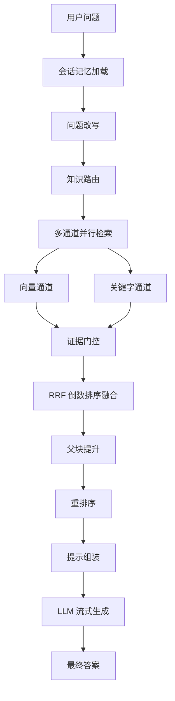
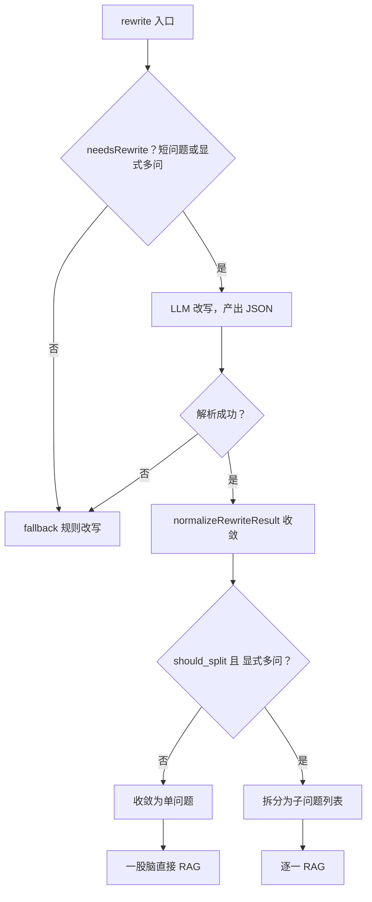
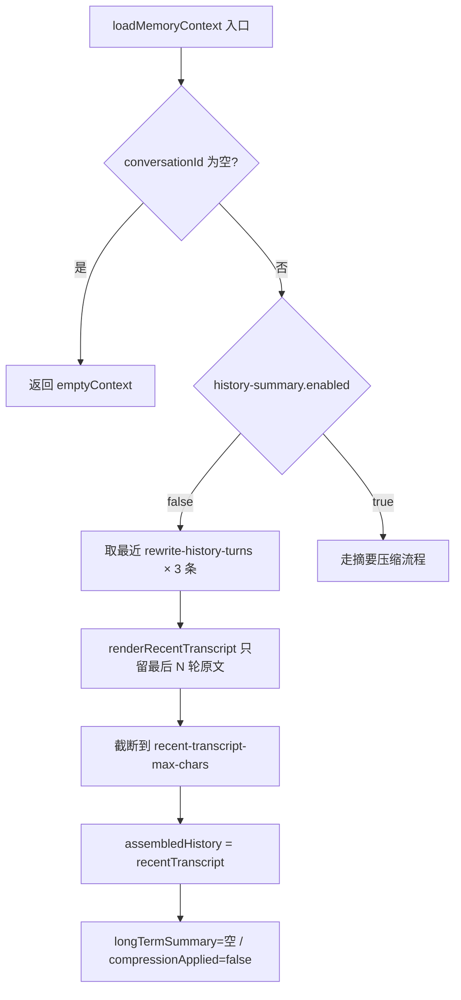
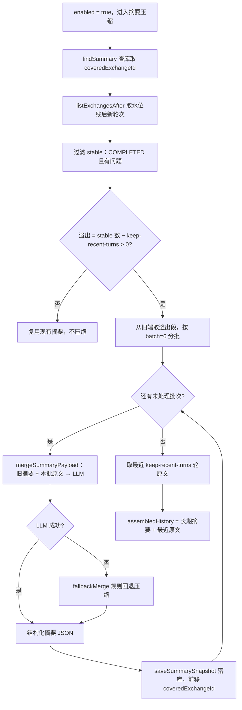

# 超级智能体笔记

> **文档说明**：本文档记录超级智能体中文档生命周期、Kafka 选型、RAG 检索链路等核心流程与设计要点，便于后续复盘与整理。

---

## 📑 目录

- [一、文档生命周期相关](#一文档生命周期相关)
  - [1.1 文档生命周期流程](#11-文档生命周期流程)
  - [1.2 为什么选择 Kafka？](#12-为什么选择-kafka)
  - [1.3 使用 Kafka 时，如何保证文档不会重复消费，或库中出现两份数据？](#13-使用-kafka-时如何保证文档不会重复消费或库中出现两份数据)
  - [1.4 消息顺序性是否有保证？](#14-消息顺序性是否有保证)
- [二、RAG 相关](#二rag-相关)
  - [2.1 RAG 流程](#21-rag-流程)
  - [2.2 为什么要做"双通道"？](#22-为什么要做双通道)
  - [2.3 RRF 为什么不用加权平均？](#23-rrf-为什么不用加权平均)
  - [2.4 为什么要分父子块两层？](#24-为什么要分父子块两层)
  - [2.5 如何做的父块提升？（如果命中多个父块怎么处理）](#25-如何做的父块提升如果命中多个父块怎么处理)
  - [2.6 问题改写与子问题拆分判断](#26-问题改写与子问题拆分判断)
- [三、会话记忆与上下文压缩](#三会话记忆与上下文压缩)
  - [3.1 两种压缩方式对比](#31-两种压缩方式对比)
  - [3.2 滑动窗口流程](#32-滑动窗口流程)
  - [3.3 摘要压缩流程](#33-摘要压缩流程)

---

## 一、文档生命周期相关

### 1.1 文档生命周期流程


**简化流程**：

```text
上传并持久化 → 解析与策略推荐 → 用户确认策略 → 触发索引构建 → 索引构建执行
```

---

### 1.2 为什么选择 Kafka？

| 维度 | 使用 kafka（异步） | 不使用 kafka（同步） |
|------|--------------------|----------------------|
| 响应速度 | 文档在后台异步解析，用户对主流程几乎无感知 | 用户需要等待整条链路执行完成，体验较差 |
| 持久化 | kafka consumer 宕机后，消息仍会保存在磁盘中，重启后可以继续消费 | 如果仅靠线程池等方式优化，程序宕机后进度容易丢失 |
| 流量削峰 | 流量上涨时，可以通过增加消费者数量或分区数量来应对 | 高峰流量更容易直接压垮服务 |

---

### 1.3 使用 Kafka 时，如何保证文档不会重复消费，或库中出现两份数据？

1. 在文档解析流程中，文档内容转成树形结构节点并入库时，采用"覆盖写"模式：先删除原有节点，再写入当前节点数据，保证库中只保留用户当前文档对应的一份结构化节点数据。

2. 文本向量入库结束后,文档向量会记录TaskId,文档对象也会记录LastIndexTaskId. 在检索阶段用LastIndexTaskId

   来从向量库查询出构建好的最新向量.这样向量库虽然会有重复的,但是根据TaskId能找出最新的.

---

### 1.4 消息顺序性是否有保证？

1. 跨阶段顺序：整体架构采用"两阶段消费 + 用户确认作为阻断点"的方式，因此两个阶段之间天然具备顺序性。
2. 单线程消费：消费者采用单线程消费模式，不使用多线程并发消费，避免同一文档消息出现乱序执行。

---

## 二、RAG 相关

### 2.1 RAG 流程



**简化流程**：

```text
用户问题 → 会话记忆加载 → 问题改写 → 知识路由 → 多通道并行检索（向量 + 关键字）
        → 证据门控 → RRF 融合 → 父块提升 → 重排序 → 提示组装 → LLM 流式生成 → 最终答案
```

**关键阶段说明**：

| 阶段 | 作用 |
|------|------|
| 会话记忆加载 | 加载历史对话摘要，识别追问场景 |
| 问题改写 | 回指消解、上下文补全、口语转书面语，可拆分多子问题 |
| 知识路由 | 三级评分（范围 → 主题 → 文档）定位最匹配文档 |
| 多通道并行检索 | 向量通道与关键字通道并行执行，互补召回 |
| 证据门控 | 过滤低质量结果，向量按绝对阈值，关键字按相对阈值 |
| RRF 融合 | 按排名而非分数融合多通道结果，缓解尺度不一致问题 |
| 父块提升 | 子块结果按父块聚合，提供更完整的章节上下文 |
| 重排序 | 使用 Cross-Encoder 模型对 Top K 候选做精排 |
| 提示组装 | 控制证据预算，避免上下文溢出与注意力稀释 |

---

### 2.2 为什么要做"双通道"？

| 通道 | 优点 | 缺点 |
|------|------|------|
| 向量通道 | 用户问题更容易命中语义相关的文本向量 | 对于一些专有名词，在向量化过程中容易被模糊 |
| 关键词通道 | 通过关键词命中文本，可精确定位文本与用户问题 | 对于语义相近的话语，但缺少相同的词就无法命中 |
| 双通道 | 结合上述两者优点达到召回率最大化 | — |

---

### 2.3 RRF 为什么不用加权平均？

1. BM2.5 和向量的评分分数范围不一致，无法通过加权来统一分数比重。
2. RRF 通过排名来制定分数，更加简单，而且对于双通道命中文本分数会更加高。

---

### 2.4 为什么要分父子块两层？

这是对于检索精度和文本内容完整性的平衡：

- **子块**：语义、关键词聚焦，面向段落、句子，更加精细，用子块（小块）的向量去找最相关片段 → 高召回精度。
- **父块**：面向章节、小标题，文本更加完整 → 给 LLM 完整上下文。

---

### 2.5 如何做的父块提升？（如果命中多个父块怎么处理）

- 按 `parent_block_id` 分组 `Map<父ID, List<子块>>`
- 查找父块内容 + 合并命中的子块摘要
- 找出父块下最优的子块分数作为 `bestChildScore`
- 父块分数 = `bestChildScore × (1 + supportWeight + multiChannelWeight)`
- 其中 `supportWeight = min(0.36, (childCount - 1) × 0.12)`

> 这意味着：一个父块下命中的子块越多、命中通道越多样，父块的整体相关性分数越高。这模拟了"一个章节中多处提及某个概念 → 该章节与问题高度相关"的直觉。

---

### 2.6 问题改写与子问题拆分判断

> 对应 `ChatQueryRewriteService#rewrite`。问题改写做两件事：①把口语/追问改写成独立可检索的书面问题；②判断要不要拆成多个子问题逐个检索。两者产出同一个 `RagRewriteResult`（rewrittenQuestion + subQuestions）。

**问题改写的作用**：

- **指代消解与上下文补全**：把"它怎么样了""那个呢"这类依赖历史的追问，补全成带具体主语的独立问题，才能拿去检索。
- **口语转书面语**：让检索更贴合文档的表达。
- **顺带判断是否拆分**：多问是否需要拆成子问题逐个检索。

**模型改写 vs 兜底改写**：

| 路径 | 触发条件 | 实现 |
|------|----------|------|
| 模型改写 | `rewriteEnabled` 且 `needsRewrite` 为真 | LLM 产出 `{rewrite, should_split, sub_questions}` JSON |
| 兜底改写 | 改写关闭 / 不需改写 / LLM 失败 / 结果不可用 | `fallback` 规则改写，永不为空 |

- `needsRewrite`：**短问题或显式多问才进模型**，又长又完整的问题放过。无历史时 <8 字、有历史时 <18 字（有上下文时短问题更可能是追问指代，更该改写），或命中显式多问信号。
- `fallback`：非显式多问 → 直接用原问题；显式多问 → `ruleBasedSplit` 按标点 `?？；;\n` 切分。

**子问题拆分的作用**：

- 逐个子问题**独立 RAG**，召回更聚焦、证据更精准，避免多问混在一起检索引入噪声。
- 最终**按编号逐一回答**（`answerSystemPrompt` 要求拆分后逐条作答）。

**如何拆分（双重校验）**：

拆分不是 LLM 一句话说了算，而是两个判断**同时成立**才真正拆，否则收敛成单问题"一股脑直接 RAG"：

- `should_split`（LLM 语义判断为 true）**且** `explicitMultiQuestion`（原始问题结构判断为真）→ 拆分
- 任一不成立 → `subQuestions = [rewrite]` 单问题（保守结构校验，防 LLM 把单问拆碎）

`explicitMultiQuestion` 对**原始问题**做 5 个结构信号匹配，命中任一即"显式多问"：

| 信号 | 判定 |
|------|------|
| 问号 | `？/?` 计数 ≥ 2 |
| 分号 | 含 `；` 或 `;` |
| 多行 | 非空行 ≥ 2 |
| 编号前缀 | `1.` `1)` `1、` `A)` 等 |
| 关键词 | 含"分别" |

拆分后的两道兜底：

- **拆了但 `sub_questions` 为空** → `ruleBasedSplit` 按标点切。
- **子问题数 > `maxSubQuestions`(4)** → 截断到 4 个。



> 一句话：**改写分模型/兜底两条路，拆分靠 `should_split` ∩ `explicitMultiQuestion` 双通过**——既不放过真正的多问，也不让 LLM 把一个完整问题拆碎。

---

## 三、会话记忆与上下文压缩

> **文档说明**：`PersistentConversationMemoryService#loadMemoryContext` 在加载会话上下文时，依据 `app.chat.rag.history-summary.enabled` 走两条不同的路：关闭时是廉价的滑动窗口，开启时是更贵的摘要压缩。两者产出的 `ConversationMemoryContext` 字段相同，但 `assembledHistory` 的构成与是否调用 LLM 截然不同。

### 3.1 两种压缩方式对比

| 维度 | 滑动窗口（enabled=false） | 摘要压缩（enabled=true，生产默认） |
|------|---------------------------|-------------------------------------|
| 压缩手段 | 截断，只留最近 N 轮原文 | LLM 蒸馏为结构化摘要，失败规则回退 |
| 旧对话去向 | 直接丢弃，模型不可见 | 折叠进长期摘要，可回溯 |
| LLM 调用 | 0 次 | 每次溢出按批次调用 |
| 持久化 | 无额外存储 | 摘要表（coveredExchangeId / version / count）|
| 近期保真 | 最近 N 轮一字不差 | 最近 K 轮一字不差 |
| 长期记忆 | 无，旧主题失忆 | 有，目标/事实/偏好/待跟进结构化保留 |
| assembledHistory | = recentTranscript | = longTermSummary + recentTranscript |
| compressionApplied | 恒为 false | 摘要非空时为 true |
| 适用场景 | 短会话、低成本、话题不回跳 | 长会话、多主题切换、需长期连贯 |

### 3.2 滑动窗口流程



**简化流程**：

```text
取最近 N×3 条 → 只留最后 N 轮原文 → 截断字符 → assembledHistory = recentTranscript（0 次 LLM，旧对话直接丢弃）
```

### 3.3 摘要压缩流程



**简化流程**：

```text
查库取水位线 → 取未压缩轮次 → 过滤稳定轮 → 算溢出 → 从旧端分批（每批6轮）→ 旧摘要+本批原文给LLM（失败规则回退）→ 落库前移水位 → 循环至批次处理完 → 拼上最近K轮原文
```

**关键点说明**：

- **只压旧的、留新的**：溢出段从 stable 列表头部（旧端）取，最新 `keep-recent-turns` 轮始终保留为原文，不进摘要。
- **分批增量**：每批最多 6 轮，压完即落库前移 `coveredExchangeId`，崩溃重跑只补未覆盖部分。
- **结构化产出**：LLM 输出七个字段（summary / conversationGoal / stableFacts / userPreferences / resolvedPoints / pendingQuestions / retrievalHints），经去重截断规范化。
- **永不为空**：LLM 调用或 JSON 解析失败时，`fallbackMerge` 用规则拼"用户关注/已有结论"+ 待跟进 + 检索词，保证摘要不空。
- **最终拼接**：长期摘要只管旧记忆，最后再拼最近 K 轮原文，`assembledHistory = 长期摘要 + "\n\n" + 最近原文`。
